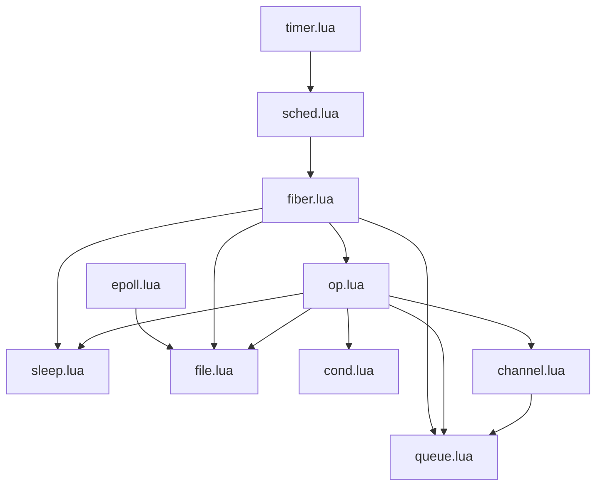

# lua-fibers

A (very) WIP multitasking framework for Lua ported from the Snabb Project's fibers
library, written by Andy Wingo as an implementation of Reppy et al's PML (the
simplified evolution of CML)

## Installation

This is a pure Lua module with the following dependencies:
  - luaposix (for micro/nano timing and sleeping options, for forking and other
    operations in the future)
  - [more to come]

## Usage

You can find examples in the `/examples` directory. Currently we have a number
of working golang ported examples in the `golang_examples` sub-directory,
showing just how closely extensive and well-tested golang patterns can be
mirrored using channels created from the CML primitives.

Much of the (excellent) documentation from the [Guile manual on
fibers](https://github.com/wingo/fibers/wiki/Manual) is directly relevant here,
with the following points to bear in mind:
  - Guile's implementation runs X fibers across Y cores, with one work stealing
    scheduler per core. The Lua port is single threaded, running in a single Lua
    process. In the future we may well implement true parallelism perhaps using
    a Lanes/Lindas approach

## Progress

Of the Snabb modules the following have so far been ported and tested:

- [x] timer.lua
- [x] sched.lua
- [x] fiber.lua
- [x] op.lua
- [x] sleep.lua
- [x] channel.lua
- [x] epoll.lua
- [ ] file.lua
- [x] cond.lua
- [x] queue.lua

After the basic core has been ported, the aim of this library is to implement 

## Implementing Go features

- [x] default in select case
- [x] sleep (already provided)
- [x] mutex
- [x] waitgroup
- [ ] rwmutex
- [ ] atomic
- [ ] waitgroup
- [ ] defer (a fiber based defer is [here](https://github.com/qrmoon/fiber/blob/main/fiber.lua)

## Original Snabb fibers module map

| name | function |
|--|--|
timer.lua | implements a hierarchical timer wheel
sched.lua | creates a task scheduler
channel.lua | cml channels
cond.lua | 
epoll.lua | 
fiber.lua | 
file.lua | 
op.lua | 
queue.lua | 
sleep.lua | 
timer.lua | 

## Notes

At present, in lumen, we use a double fork method to create a parent which waits
for the grandchild proces executing an external command to complete, so that we
don't block in the main process. However, could we use a SIGCHLD signal to do
this? There's information but also quite a lot of criticism about this approach:

https://stackoverflow.com/questions/71855507/how-can-i-wait-for-both-a-file-descriptor-and-child-state-change-simultanously
https://lua-l.lua.narkive.com/HHwP2fg9/lua-threading-sockets
http://lua-users.org/lists/lua-l/2014-09/msg00410.html
https://luaposix.github.io/luaposix/examples/signal.lua.html
