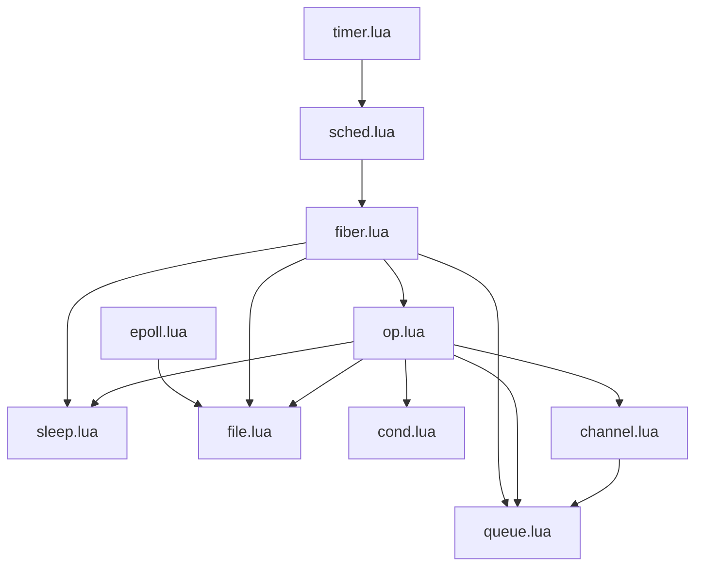

# lua-fibers

Lightweight Go-like concurrency and non-blocking IO for Lua (5.1-5.4) and LuaJIT.

```lua
local function fibonacci(c, quit)
    local x, y = 0, 1
    local done = false
    repeat
        perform(
            choice(
                c:put_op(x):wrap(function(value)
                    x, y = y, x+y
                end),
                quit:get_op():wrap(function(value)
                    print("quit")
                    done = true
                end)
            )
        )
    until done
end

fiber.spawn(function()
    local c = channel.new()
    local quit = channel.new()
    fiber.spawn(function()
        for i=1, 10 do
            print(c:get())
        end
        quit:put(0)
    end)
    fibonacci(c, quit)
    fiber.stop()
end)

fiber.main()
```

Ported from the Snabb Project's [`fibers`](https://github.com/snabbco/snabb/tree/master/src/lib/fibers) and [`streams`](https://github.com/snabbco/snabb/tree/master/src/lib/stream) libraries, written by
Andy Wingo as an implementation of Reppy et al's Concurrent ML(CML), and a fibers-based reimplementation of Lua's streams enabling smooth non-blocking access to files and sockets.

Inspired by Andy's [blog post](https://wingolog.org/archives/2018/05/16/lightweight-concurrency-in-lua) introducing fibers on Lua

## Usage

You can find examples in the `/examples` directory.

Much of the (excellent) documentation from the [Guile manual on
fibers](https://github.com/wingo/fibers/wiki/Manual) is directly relevant here,
with the following points to bear in mind:
  - Guile's implementation runs X fibers across Y cores, with one work stealing
    scheduler per core. The Lua port is single threaded, running in a single Lua
    process. In the future we may well implement true parallelism perhaps using
    a Lanes/Lindas approach

## Installation

This is a pure Lua (with FFI) module with the following dependencies:
  - lua-posix (for micro/nano timing and sleeping options, for forking and
  other syscall operations)
  - libffi and lua-cffi (if not using LuaJIT)
  - lua-bit32 (if not using LuaJIT)

These dependencies will be installed in a VScode devcontainer automatically. To install manually follow the following steps:

1. Copy the `fibers` directory somewhere lua can find it
1. Choose between Lua and LuaJIT:
   1. If using LuaJIT:
      1. Install LuaJIT (tested with 2.1.0-beta 3) according to your platform instructions
   1. If using Lua:
      1. Install Lua (5.1 to 5.4) according to your platform instructions
      1. bit32 with `luarocks install bit32`
      1. Install `libffi`
      1. Install `cffi-lua` with `luarocks install cffi`
1. Install dependencies:
   1. luaposix with `luarocks install luaposix`

### Installation with LuaJIT on OpenWRT

This is the simplest set up for running on OpenWRT.

`opkg update; opkg install luajit; opkg install luaposix`

Note that `luaposix` should be installed with `opkg` and not with `luarocks` in this context.

That's it!

## Why Fibers?

There are many possible advantages of fibers, in comparison to other async models such as callbacks, async/await, and promises. This is especially in highly complex programs with lots of semi-independent code doing async IO (such as in-process microservices).

|   | **Callbacks** | **Promises** | **Async/Await** | **Fibers** |
|---|---|---|---|---|
| **Readability** | Less readable due to "callback hell", a situation where callbacks are nested within callbacks, making the code hard to read and debug. | More readable than callbacks, but still requires then-catch chains for error handling, which can become cumbersome. | Most readable, as it makes asynchronous code look synchronous, improving comprehension and maintainability. | Very readable, since fibers can be used to write asynchronous code in a synchronous style without the need for callbacks or promises. |
| **Stack Traces** | Less clear, as each callback function creates a new stack frame, so errors can be hard to trace back to their origin. | Better than callbacks, but still might have challenges because Promises swallow errors if not handled correctly. | Good, because async/await allows to use traditional try-catch error handling which provides clear stack traces. | Best, because fibers maintain their own stack, providing a clean and comprehensive  trace. |
| [**'Coloured Function' Problem**](https://journal.stuffwithstuff.com/2015/02/01/what-color-is-your-function/) | Highly affected. If a function is asynchronous (uses callbacks), all of its callers must be too. | Less affected, but still present to some extent.  | Still present but significantly reduced as compared to callbacks and promises.  | Not affected. Fibers can pause and resume execution, meaning asynchronous functions can be called as if they were synchronous, without requiring callers to be async. |
| **Debugging** | Difficult, because the asynchronous nature of callbacks can make it hard to step through the code or maintain a consistent state for inspection. | Easier than callbacks, but may still be challenging due to the chaining of promises. | Easier, because async/await can be stepped through like synchronous code. | Easiest, because fibers allow you to write code that's structurally synchronous and therefore easier to debug. |
| **Performance** | Callbacks are generally faster as there is no extra abstraction layer. But the complexity may increase with the number of operations. | Promises have extra abstraction which may have some performance impact. | Similar performance to promises as it's built on top of them. | Fibers may introduce some performance overhead as each fiber has its own stack, but this is small and outweighed by benefits in terms of readability, error handling, and simplicity. |


## Beyond Go's concurrency

This library implements a simple version of Concurrent ML(CML), and provides primitives very similar to those offered by Go. However, while both Go and CML offer powerful models for concurrent programming, the flexibility and expressibility of Concurrent ML's first-class synchronisable events (here called 'operations') provide more advanced mechanisms to handle complex synchronisation scenarios.

|   | Go | Concurrent ML (CML) |
|---|---|---|
| Basic Mechanism | Uses goroutines and channels as the primary concurrency mechanisms. | Uses threads and synchronous message-passing channels, but also introduces the concept of 'synchronisable events'. |
| Choice | Provides non-deterministic choice over multiple channel operations using the `select` statement. However, it can only work with channels and the options must be statically declared at compile-time. | Supports non-deterministic choice among a dynamic set of 'synchronisable events' that can be constructed at runtime. These events can represent a wider variety of actions beyond just message-passing. |
| Timeouts | Achievable with `select` and timer channels. However, the syntax can be more verbose. | Timeouts are easily created as an event and composed with other events using the choice combinator. |
| User-Defined Concurrency Primitives | Limited. The primary concurrency primitive is the channel, and `select` can't be easily extended by users. | Highly flexible. CML's first-class events and combinators allow users to build their own high-level concurrency primitives (like barriers, semaphores, or read/write locks). These user-defined primitives can be composed and manipulated just like built-in ones. |
| Overall Flexibility | Go's model is relatively simple and straightforward, but may not have the necessary flexibility for more complex synchronisation patterns. | CML's model is extremely flexible, allowing for the expression of complex synchronisation patterns in a direct and elegant manner. |

## Progress

All of the Snabb 'fibers' modules the following have so far been ported and
tested. All of Snabb's 'stream' module has also been ported, which can do
non-blocking reads and writes from file descriptors using familiar `line`
and `all` approaches.

We use the `cffi` module to port Wingo's `luajit` C ffi based
buffers implementation in a way that will work across multiple architectures, as
Lua versions of these buffers would be inefficient and lead to allocation and
garbage collection without a substantial investment of time.

## Structured concurrency

While it's fun spinning off fibers/goroutines like popcorn, it comes with a [cost](https://vorpus.org/blog/notes-on-structured-concurrency-or-go-statement-considered-harmful/). Structured concurrency is a possible enhancement, basically the idea that no fiber/goroutine should outlive its parent:
https://about.sourcegraph.com/blog/building-conc-better-structured-concurrency-for-go


## Fibers module map


