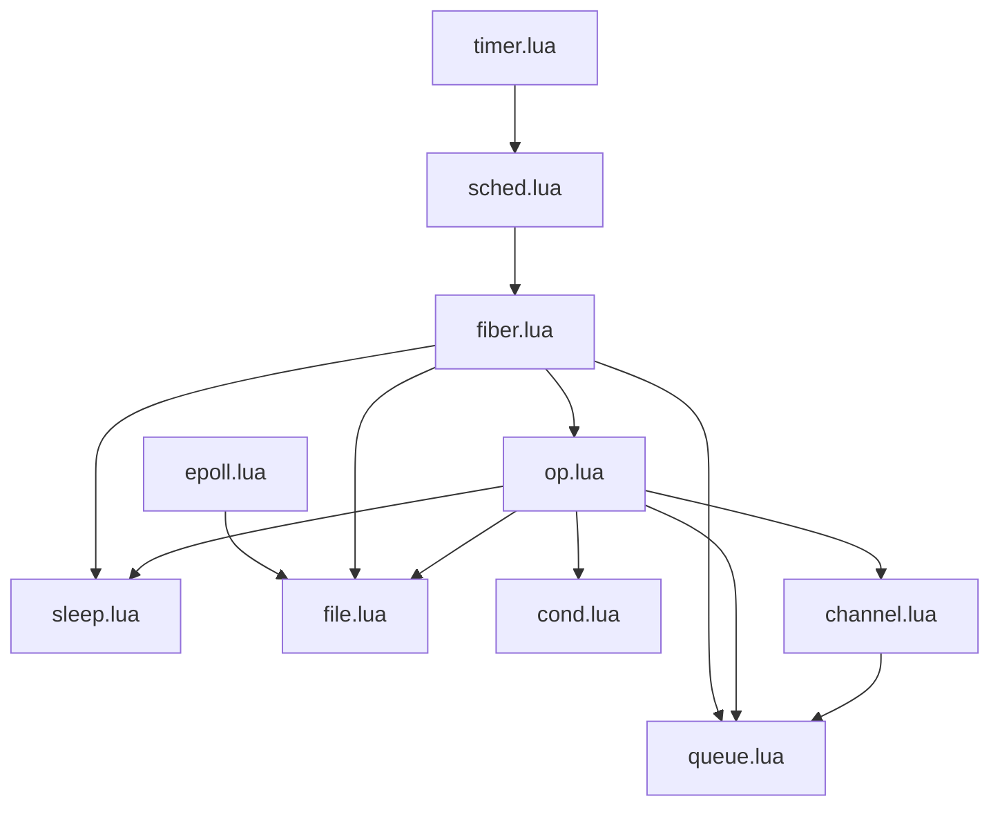

# lua-fibers

A WIP multitasking framework for Lua built aound the Snabb Project's fibers
library, written by Andy Wingo as an implementation of Reppy et al's PML (the
simplified evolution of CML)

## Usage

You can find examples in the `/examples` directory. Currently we have a working
channel based prime sieve

## Original module map

| name | function |
|--|--|
timer.lua | implements a hierarchical timer wheel
sched.lua | creates a task scheduler
channel.lua | cml channels
cond.lua | 
epoll.lua | 
fiber.lua | 
file.lua | 
op.lua | 
queue.lua | 
sleep.lua | 
timer.lua | 
