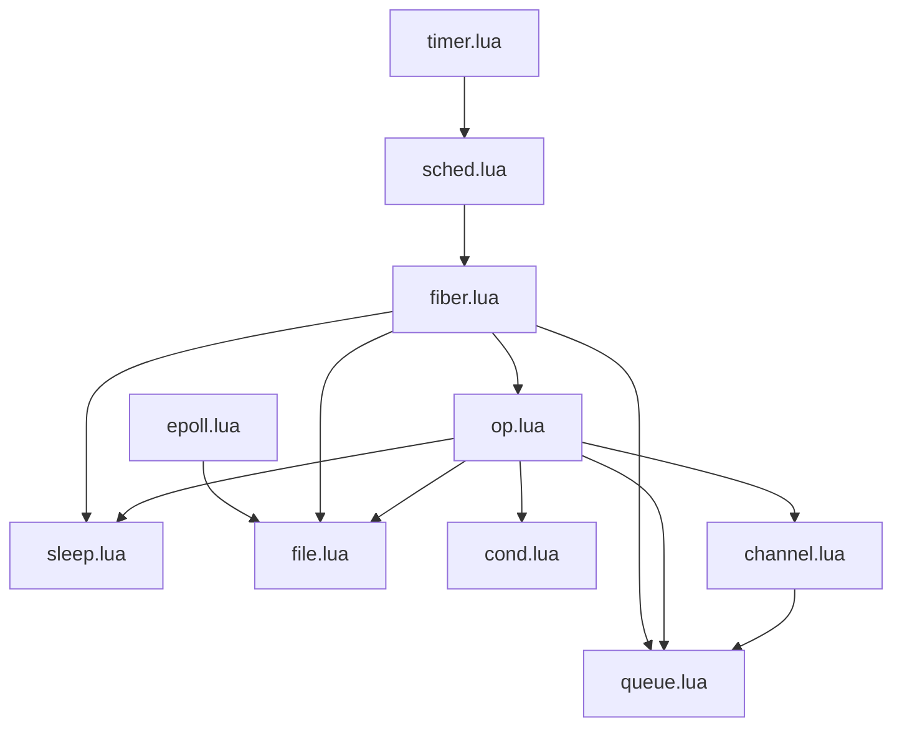

# lua-fibers

A (very) WIP multitasking framework for Lua ported from the Snabb Project's fibers
library, written by Andy Wingo as an implementation of Reppy et al's PML (the
simplified evolution of CML)

## Installation

This is a pure Lua module with the following dependencies:
  - lunix (for micro/nano timing and sleeping options, for forking and other
    operations in the future)
  - lua-epoll

These dependencies will be installed 

## Usage

You can find examples in the `/examples` directory. Currently we have a number
of working golang ported examples in the `golang_examples` sub-directory,
showing just how closely extensive and well-tested golang patterns can be
mirrored using channels created from the CML primitives.

Much of the (excellent) documentation from the [Guile manual on
fibers](https://github.com/wingo/fibers/wiki/Manual) is directly relevant here,
with the following points to bear in mind:
  - Guile's implementation runs X fibers across Y cores, with one work stealing
    scheduler per core. The Lua port is single threaded, running in a single Lua
    process. In the future we may well implement true parallelism perhaps using
    a Lanes/Lindas approach

## Progress

Of the Snabb fibers modules the following have so far been ported and tested:

- [x] timer.lua
- [x] sched.lua
- [x] fiber.lua
- [x] op.lua
- [x] sleep.lua
- [x] channel.lua
- [x] epoll.lua
- [x] file.lua
- [x] cond.lua
- [x] queue.lua

After the basic core has been ported, the aim of this library is to implement
streams from the core snabb library, these will allow for non-blocking reads
from file descriptors using familiar `line` and `all` approaches. Without these the
current epolls on file descriptor might indicate readiness for reading but not
actually have a whole line or complete content ready to deliver.

- [x] stream.lua
- [x] stream/file.lua
- [x] stream/mem.lua
- [x] stream/compat.lua
- [ ] stream/socket.lua

We  use the `cffi` module to port Wingo's `luajit` C ffi based
buffers implementation in a way that will work across multiple architectures, as
Lua versions of these buffers would be inefficient and lead to allocation and
garbage collection without a substantial investment of time. 

## Implementing Go's concurrency

Go (through the [TinyGo project](https://tinygo.org/)) is becoming a viable
target for embedded development, both running on baremetal MCUs as well as on
Linux. At present support for key architectures, [like MIPS, is
incomplete](https://github.com/tinygo-org/tinygo/issues/1075), and support is
patchy across the Go standard library. However, given the very [rapid
growth](https://star-history.com/#tinygo-org/tinygo&Date) of this project and
its ambitious aim of (almost) full support for standard Go, this becomes a
natural progression for more efficent code.

To this end one of the first packages we'll build with fibers is a 'go-lua'
library that will seek to offer all of Go's concurrency primitives and
conveniences, including:

- [x] default in select case
- [x] sleep (already provided)
- [x] mutex
- [x] waitgroup
- [ ] rwmutex
- [ ] atomic (will be inefficent without recourse to assembler level atomic
  instructions, c'est la vie)
- [ ] waitgroup
- [ ] defer (a fiber based defer is
  [here](https://github.com/qrmoon/fiber/blob/main/fiber.lua)

## Structured concurrency

https://about.sourcegraph.com/blog/building-conc-better-structured-concurrency-for-go

## Original Snabb fibers module map

| name | function |
|--|--|
timer.lua | implements a hierarchical timer wheel
sched.lua | creates a task scheduler
channel.lua | cml channels
cond.lua | 
epoll.lua | 
fiber.lua | 
file.lua | 
op.lua | 
queue.lua | 
sleep.lua | 
timer.lua | 

## Notes

At present, in lumen, we use a double fork method to create a parent which waits
for the grandchild proces executing an external command to complete, so that we
don't block in the main process. However, could we use a SIGCHLD signal to do
this? There's information but also quite a lot of criticism about this approach:

  - https://stackoverflow.com/questions/71855507/how-can-i-wait-for-both-a-file-descriptor-and-child-state-change-simultanously
  - https://lua-l.lua.narkive.com/HHwP2fg9/lua-threading-sockets
  - http://lua-users.org/lists/lua-l/2014-09/msg00410.html
  - https://luaposix.github.io/luaposix/examples/signal.lua.html

So what happens when we open a file using lib/stream/compat on Snabb?

  1. io.open() is simply lib.stream.file.open()
  2. lib.stream.file.open() uses the syscall open() function to open the
     filename to get the fd. The fd is passed to fdopen().
  3. lib.stream.file.fdopen() creates an io using new_file_io(). This creates a
     new lib.stream.file object. this object is passed to lib.stream.open()
  4. the passed in file object becomes the io field of a new stream object
     created by lib.stream.open()
  5. lots of methods for streams are simply methods of the stream's io object
     which is a lib.stream.file object
  6. interestingly, take a method on the stream like write, it takes a _c
     pointer_ (either taken by `peek`ing at the tx buffer or using `ffi.cast()`
     to cast the string to be written into a C byte array and getting the
     resulting address) as the location of a buffer that is passed directly to
     ljsyscall's write function which (like the underlying c system call) can
     deal with being passed a pointer. Neither luaposix nor lunix, have
     functions that can deal with this.
  7. So what are our choices? We could move to buffers based on strings.
     However, this will either be highly inefficient (eg popping strings from
     buffers and then writing those into standard lunix/luaposix functions -
     string operations are slow and create tons of garbage) or complex (creating
     efficient(ish) buffers in pure Lua will be long). Alternatively we can use
     cffi to just simply wrap the relevant c functions and call them where
     they're needed.

