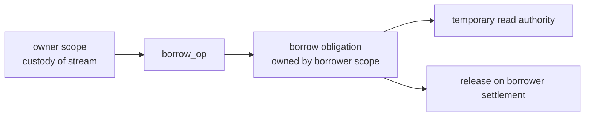

# Authority and borrowing

Custody and authority are separate.

Custody is responsibility to resolve an obligation.  Authority is permission to
act through a handle.  A scope may own a stream, task, file or process without
having lent every possible user the right to operate it.  Conversely, a borrower
may use a value for a time without becoming responsible for settling it.

This distinction is the seam from which membranes, phases and safe protocol
views can be built.

## Five related words

```text
custody    who must resolve this obligation
authority  who may act through this handle now
borrow     temporary authority without custody
lease      compatibility-managed temporary right
claim      exclusive authority to resolve custody
```

A claim is not a lease.  `Claim` language is reserved for custody resolution.
The public atom for compatible temporary rights is `Lease`.

## Owned authority

A minimal authority check asks whether a scope currently owns a live, unclaimed
record for the item and whether the requested right is permitted.

```lua
fibers.perform(scope:authorise_op(stream, 'write'))
```

Most code should not call `authorise_op` directly.  Safe handles should call it
internally before operations that require authority.  The operation participates
in the ordinary transaction machinery, so an unauthorised use is a failure of the
candidate world rather than an after-the-fact surprise.

The present implementation provides the seam and uses it for owned and borrowed
records.  Flow endpoint byte movement now consults this authority seam: owned
inlets require write authority for writes, and owned outlets require read
authority for reads and leases.  Not every existing handle has yet been
rewritten to enforce authority for every method; close and settlement paths
remain deliberately permissive so settlement can discharge claimed resources.

## Borrowing

Borrowing grants authority without transferring custody.

```lua
local borrow = fibers.perform(reader_scope:borrow_op(stream, { 'read' }))
```

The borrowing scope owns the borrow obligation.  The original owner still has
custody of the stream.  When the borrower settles, the borrow releases its
leases and authority disappears.



Borrowing has three consequences:

```text
it gives the borrower specified rights
it records compatible leases so conflicting borrows cannot coexist
it creates an owned obligation that must settle with the borrower
```

## Compatibility

The `Lease` atom records compatible temporary rights.  For example, two readers
may coexist, while a writer excludes readers and other writers if the resource's
lease policy says so.

```text
read  + read   compatible
read  + write  incompatible
write + write  incompatible
```

The exact compatibility table belongs to the resource or facility.  `Lease` is
the atom that makes the table transactional.

## What borrowing is not

Borrowing is not movement.  Movement changes custody.

Borrowing is not settlement.  Settlement resolves custody.

Borrowing is not a Lua reference discipline by itself.  A Lua table may still be
reachable after authority has expired.  The safe facility must check authority
before performing sensitive operations.

Borrowing is not a membrane, but a membrane should be built from borrowing.  A
membrane is a boundary that grants, translates or denies authority in declared
forms.

## Phase use

Phases need borrowing because a later interval may be allowed to observe or act
on a value without taking permanent custody.  Render extraction, for example,
may borrow the world read-only and then release that authority at the phase
boundary.  The frame can advance only when those borrows have settled.
