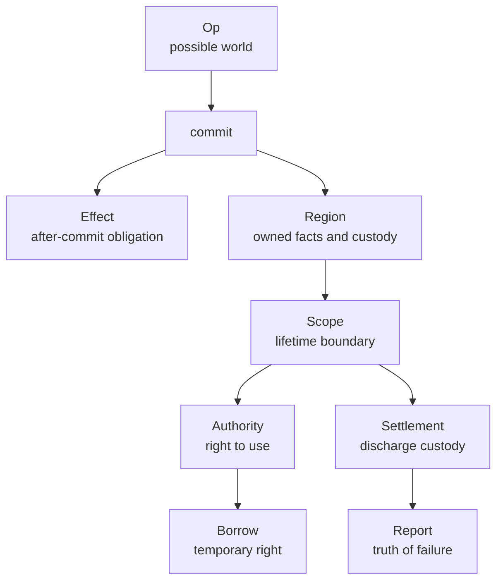
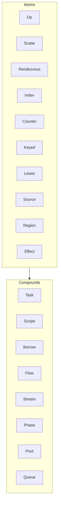

# Lifetime calculus

Fibres treats concurrent computation as the creation, transfer, use and
settlement of obligations.

An `Op` describes a possible committed world.  A `Region` records the ownership
facts that survive commit.  A `Scope` is the ordinary custody boundary for those
facts.  Authority governs who may act through a handle.  Settlement discharges
custody, or records why custody could not be discharged.

This document gives the conceptual account.  For the user-facing scope API, see
`docs/scope.md`.  For the executable laws, see `docs/scope_laws.md`.

## The central correspondence

```text
transaction is truth at the moment of commit
lifetime is truth that remains after commit
```

A transaction may create work, transfer a handle, reserve capacity, observe an
external occurrence or emit a runtime effect.  Some of those consequences end at
commit.  Others survive.  Anything that survives as responsibility is an
obligation and must have custody.



The library is therefore not only a scheduler.  It is a small system for keeping
running software honest about what it owns, what it may use, what it has moved,
and what it failed to settle.

## Vocabulary

| Word | Meaning |
| --- | --- |
| Obligation | A continuing responsibility created, admitted or moved by a committed world. |
| Custody | Responsibility to resolve an obligation. |
| Authority | Permission to act through a handle. |
| Borrow | Temporary authority without custody. |
| Lease | Compatibility-managed temporary right. |
| Claim | Exclusive authority to resolve custody. |
| Admission | Committed entry of an obligation into custody. |
| Movement | Atomic transfer of custody. |
| Seal | Stop a scope or region accepting new custody. |
| Resolve | Complete a claim by discharge, failure or restoration. |
| Settlement | Resource-specific work that attempts to discharge custody. |

The words are deliberately distinct.  Custody answers who must resolve a thing.
Authority answers who may use it.  Borrowing lends authority without moving
custody.  A claim is not a lease: a claim is exclusive resolution authority over
custody, while a lease is a compatibility-managed temporary right.

## Atoms and compounds

The atom kit contains the small nouns that explain the algebra:

```text
Op          possible committed world
Scalar      replacement fact or small state machine
Rendezvous  synchronous meeting
Index       ordered stock
Counter     numeric stock
Keyed       per-key fact
Lease       compatible temporary rights
Source      external occurrence admitted as transactional fact
Region      ownership and custody ledger
Effect      committed runtime obligation
```

Facilities such as `Task`, `Scope`, `Flow`, `Stream`, `Pool`, `Queue`, `Borrow`
and `Phase` are compounds built from those atoms.  They may be essential in
practice, but they are not atoms.  This distinction keeps the public theory
small while allowing richer forms to appear.



## Scope as the ordinary face

Most users should not begin with the calculus.  They should begin with a scope:

```lua
fibers.scope(function(scope)
  local task = fibers.spawn(function()
    return 'ok'
  end)

  local value = fibers.perform(task:await_op())
end)
```

The ordinary contract is:

```text
Create lifetime-bearing things inside a scope.
They will be settled when the scope exits.
If something cannot be settled, the error remains visible.
Move or borrow things explicitly when they must cross the boundary.
```

The deeper contract is:

```text
admit      take custody
move       transfer custody atomically
authorise  prove a right to use
borrow     grant temporary authority without custody
claim      take exclusive resolution authority
resolve    discharge, fail or restore a claim
seal       stop new custody
observe    explain the ledger
```

The surface API and the calculus should remain the same system at different
magnifications.

## Failure remains truth

Cleanup failure is often treated as secondary noise during unwinding.  In this
library it is lifetime state.

If settlement fails after a claim commits, the owned record is not silently
released.  It remains visible in `failed` phase and is carried in the boundary report.
Policy may then fail the scope, retry, restore, or later move the unresolved
obligation into a tomb-like facility.

This is the moral centre of the lifetime design:

```text
a failed settlement is not an exception that vanished
it is an obligation whose resolution is still unfinished
```

## What belongs above this layer

Higher forms such as phases, membranes, escrow, mirrors and tombs should be
built over the same verbs rather than bypassing them.

```text
Phase      rhythmic scope interval with declared crossings
Membrane   authority translation at a boundary
Escrow     custody awaiting lawful adoption
Mirror     owned maintained observation
Tomb       custody of unresolved settlement
Covenant   named agreement among operations
Braid      linked flow fate and lineage
Weather    admitted changing external condition
```

These names are quarry notes until the implementation earns them.  They are
valuable only where they reduce ambiguity in the existing calculus.
